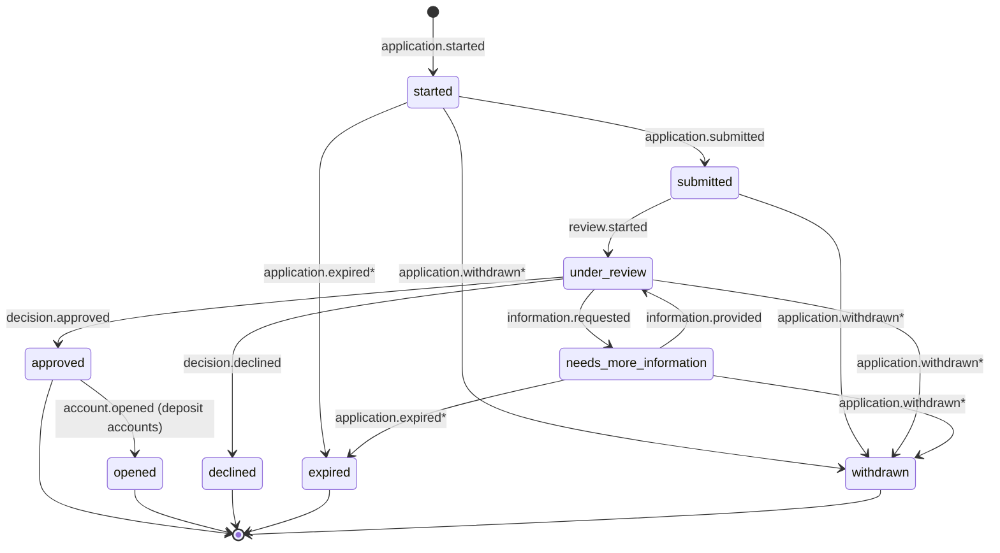

# Application Outcome & Status Standard (AOSS)

**Version:** 0.1.0 (Draft for Comment)
**Status:** Draft — published for review and feedback; not yet stable
**Maintainer:** Melissa Rojas
**License:** Apache-2.0 (proposed)

---

## 1. Purpose & Scope

### 1.1 Purpose

The Application Outcome & Status Standard (AOSS) defines a common vocabulary, state model, and interface contract for the lifecycle of consumer financial applications — specifically checking/savings account opening and credit application intake — from the moment an applicant begins a flow to the moment a final outcome is communicated.

Financial institutions and fintech platforms typically assemble onboarding from many parts: native mobile clients, internal decision systems, and third-party verification services (identity/KYC, fraud signals, document verification, eligibility and underwriting). Each of these systems reports status in its own vocabulary. The result is familiar to any team that has built onboarding more than once: inconsistent statuses across channels, ambiguous "pending" states that neither applicants nor support agents can interpret, vendor-specific error handling scattered through application code, and outcome messaging that is rebuilt — often inconsistently — for every product launch.

AOSS addresses this by standardizing three things:

1. **A canonical status taxonomy and state machine** for application lifecycle progression.
2. **A normalized error taxonomy and outcome object model**, including machine-readable status, human-readable explanation, and structured next-step guidance.
3. **Interface and observability requirements** for a backend "middle layer" that sits between client applications and decision/verification systems, normalizing their heterogeneous responses into the taxonomy above.

**Division of responsibility.** AOSS is deliberate about who owns what, because the boundary is what makes the standard adoptable by competing institutions:

- **Adopting institutions and their decision systems decide.** They determine each application's disposition and the actual reasons behind it, and they own the versioned reason catalog (Section 7) whose approved entries are the only decline reasons that ever reach an applicant. AOSS never authors, rewords, or supplements the substance of a decision: for adverse outcomes in particular, the stated reasons must be the institution's actual reasons, and only the deciding systems know them.
- **The middle layer standardizes and guarantees.** It transforms heterogeneous vendor and internal responses into the canonical statuses, error categories, and outcome structures, and it enforces the transparency guarantees that make outcomes interpretable: declines always carry specific, ranked reasons drawn from the catalog (Section 7); non-terminal statuses requiring applicant action always carry typed next steps (Section 5); display fields are applicant-safe by construction, never exposing vendor names, internal system detail, or raw scores (Section 5.2). In AOSS, transparency is a property of the contract, not a copywriting exercise performed by infrastructure.
- **Clients render with fidelity.** Conformant clients present statuses, reasons, and next steps exactly as supplied, never generating, softening, reordering, or paraphrasing them, so that what the applicant sees is what the institution decided, consistently across channels and across every adopting institution.

This division is why the same infrastructure can serve competitors: the standard carries no opinion about any adopter's policy. It constrains only how policy outcomes are represented, communicated, and audited.

### 1.2 Scope

This specification covers:

- The canonical application status model (Section 3).
- Transition events and the rules governing state progression (Section 3).
- The error taxonomy: categories, semantics, retryability, and user-communication guidance (Section 4).
- The outcome object: structure, required fields, and population rules (Section 5).
- Audit and observability requirements: correlation IDs, event logs, timestamps, PII redaction (Section 6).
- Guidance for structuring adverse-outcome information so adopting institutions can meet their own regulatory communication obligations (Section 7).
- Versioning and deprecation policy (Section 8).
- Conformance requirements (Section 9).

This specification does **not** cover:

- Decision logic itself (credit policy, KYC rules, fraud thresholds). AOSS standardizes how decisions and statuses are _represented and communicated_, not how they are made.
- Authentication, authorization, and session management. Transport credentials for middle-layer APIs are issued and validated by the adopter's own infrastructure (e.g., an API gateway or identity provider), and applicant-facing verification steps such as one-time-code contact verification are likewise the adopter's responsibility. AOSS assumes an authenticated transport context and defines what flows across it; adopters remain responsible for enforcing caller-scoped visibility of application resources.
- Legal or compliance advice. Section 7 describes information-structure requirements that support common regulatory needs; adopting institutions remain responsible for their own compliance determinations with qualified counsel.
- Vendor selection. AOSS is vendor-neutral; the companion adapter contract (see `ADAPTERS.md`) defines how any vendor's responses are mapped into this standard.

Companion documents in this repository:

- `openapi.yaml` — the middle-layer API contract.
- `ADAPTERS.md` — the vendor adapter interface and mapping rules.
- `TESTING.md` — contract and conformance testing approach.

### 1.3 Audience

Engineers and architects implementing onboarding flows and decisioning integrations; teams building client SDKs against the middle-layer contract; product and compliance stakeholders who need a shared vocabulary for application states and outcomes.

---

## 2. Terminology

The key words **MUST**, **MUST NOT**, **REQUIRED**, **SHALL**, **SHALL NOT**, **SHOULD**, **SHOULD NOT**, **RECOMMENDED**, **MAY**, and **OPTIONAL** in this document are to be interpreted as described in RFC 2119.

| Term                 | Definition                                                                                                                                                                                                         |
| -------------------- | ------------------------------------------------------------------------------------------------------------------------------------------------------------------------------------------------------------------ |
| **Application**      | A single applicant-initiated request for a financial product (deposit account or credit product), tracked from initiation to a terminal state.                                                                     |
| **Applicant**        | The consumer submitting the application.                                                                                                                                                                           |
| **Adopter**          | An institution or platform implementing this specification.                                                                                                                                                        |
| **Middle layer**     | The AOSS-conformant backend service that mediates between clients and decision/verification systems.                                                                                                               |
| **Decision system**  | Any internal or third-party system that evaluates an application or a component of it: identity/KYC verification, fraud scoring, document verification, manual review queues, eligibility or underwriting engines. |
| **Adapter**          | The integration component that translates between a specific decision system's interface and the AOSS taxonomy. See `ADAPTERS.md`.                                                                                 |
| **Status**           | The canonical lifecycle state of an application, drawn exclusively from the taxonomy in Section 3.                                                                                                                 |
| **Transition event** | A recorded occurrence that moves an application from one status to another.                                                                                                                                        |
| **Outcome**          | The structured object communicating an application's current status, explanation, and next steps (Section 5).                                                                                                      |
| **Terminal state**   | A status from which no further transitions are permitted.                                                                                                                                                          |
| **Correlation ID**   | An identifier propagated across all systems participating in the processing of a single request or application, used to join logs and events end to end.                                                           |
| **Idempotency key**  | A client-supplied key that makes a mutating request safely retryable.                                                                                                                                              |
| **PII**              | Personally identifiable information (e.g., name, government identifiers, date of birth, address, images of identity documents).                                                                                    |

---

## 3. The Status Model

### 3.1 Design principles

1. **One taxonomy, everywhere.** Every surface — mobile client, middle layer, event stream, audit log, support tooling — MUST use the canonical statuses. Vendor-specific or system-specific statuses MUST be mapped at the adapter boundary and MUST NOT leak past it.
2. **Deterministic progression.** Status transitions MUST follow the state machine defined here. An implementation MUST reject (and log) any transition not permitted by the machine, rather than silently applying it.
3. **Statuses are coarse; detail lives elsewhere.** The status answers "where is this application in its lifecycle?" Finer-grained detail — _why_ it is under review, _what_ information is needed — belongs in the outcome object (Section 5) and next-step structures, not in an ever-growing status list.
4. **Terminal means terminal.** Once an application reaches a terminal state, its status MUST NOT change. A returning applicant starts a new application (which MAY reference the prior one).

### 3.2 Canonical statuses (v0.1 core)

| Status                   | Meaning                                                                                                                                                                                                                       | Terminal |
| ------------------------ | ----------------------------------------------------------------------------------------------------------------------------------------------------------------------------------------------------------------------------- | -------- |
| `started`                | The applicant has initiated an application; intake is in progress and the application has not been submitted for evaluation.                                                                                                  | No       |
| `submitted`              | The applicant has completed intake and the application has been accepted by the middle layer for processing. This is the point at which the middle layer has durably recorded the application and returned an acknowledgment. | No       |
| `under_review`           | The application is being evaluated by one or more decision systems (automated or manual).                                                                                                                                     | No       |
| `needs_more_information` | Evaluation is paused pending additional input from the applicant (e.g., a clearer document image, a clarifying detail, an additional disclosure acknowledgment).                                                              | No       |
| `approved`               | The application has been approved. For credit products, this is the final positive lifecycle status in v0.1.                                                                                                                  | Yes¹     |
| `opened`                 | **Variant of `approved` for deposit accounts:** the approved account has been provisioned and is available to the applicant. Deposit-account implementations SHOULD progress `approved → opened` when provisioning completes. | Yes      |
| `declined`               | The application has received an adverse decision and will not proceed.                                                                                                                                                        | Yes      |

¹ `approved` is terminal for credit products. For deposit accounts, `approved` permits exactly one further transition, to `opened`.

### 3.3 Extension statuses (v0.1 proposals)

The following terminal states model abandonment and inactivity. They are **proposed extensions in v0.1**, published for comment; adopters MAY implement them, and feedback on their semantics is specifically requested.

| Status      | Meaning                                                                                                                                                                                                                                                                           | Terminal |
| ----------- | --------------------------------------------------------------------------------------------------------------------------------------------------------------------------------------------------------------------------------------------------------------------------------- | -------- |
| `expired`   | The application was abandoned by inactivity: the applicant did not complete intake, or did not respond to an information request, within the adopter's configured window. Expiry MUST be driven by an explicit, logged event (e.g., a scheduled sweep), never by ad-hoc mutation. | Yes      |
| `withdrawn` | The applicant (or an authorized operator acting on the applicant's request) actively cancelled the application before a decision was reached.                                                                                                                                     | Yes      |

Distinguishing `expired` (passive) from `withdrawn` (active) matters operationally: they imply different re-engagement strategies, different record-keeping treatment under adopter policy, and different applicant communications.

### 3.4 Transition events and allowed transitions

Every status change MUST be caused by a named transition event and recorded as a `StatusEvent` (Section 6.2). The permitted transitions are:

| #    | From                     | To                       | Event                   | Typical trigger                                                                        |
| ---- | ------------------------ | ------------------------ | ----------------------- | -------------------------------------------------------------------------------------- |
| 1    | _(none)_                 | `started`                | `application.started`   | Applicant begins intake; client or middle layer creates the application record.        |
| 2    | `started`                | `submitted`              | `application.submitted` | Applicant completes intake; middle layer validates and durably records the submission. |
| 3    | `submitted`              | `under_review`           | `review.started`        | Middle layer dispatches the application to one or more decision systems.               |
| 4    | `under_review`           | `needs_more_information` | `information.requested` | A decision system or reviewer requires applicant input.                                |
| 5    | `needs_more_information` | `under_review`           | `information.provided`  | Applicant supplies the requested input; evaluation resumes.                            |
| 6    | `under_review`           | `approved`               | `decision.approved`     | All required evaluations completed favorably.                                          |
| 7    | `under_review`           | `declined`               | `decision.declined`     | An evaluation produced an adverse decision under adopter policy.                       |
| 8    | `approved`               | `opened`                 | `account.opened`        | Deposit accounts only: provisioning completed.                                         |
| 9\*  | `started`                | `expired`                | `application.expired`   | Intake inactivity window elapsed.                                                      |
| 10\* | `needs_more_information` | `expired`                | `application.expired`   | Information-request response window elapsed.                                           |
| 11\* | `started`                | `withdrawn`              | `application.withdrawn` | Applicant cancelled during intake.                                                     |
| 12\* | `submitted`              | `withdrawn`              | `application.withdrawn` | Applicant cancelled before review began.                                               |
| 13\* | `under_review`           | `withdrawn`              | `application.withdrawn` | Applicant cancelled during review, where adopter policy permits.                       |
| 14\* | `needs_more_information` | `withdrawn`              | `application.withdrawn` | Applicant cancelled while input was pending.                                           |

\* Rows 9–14 apply only where the v0.1 extension statuses (Section 3.3) are implemented.

Rules:

- Transitions not listed above MUST be rejected. In particular: `declined`, `opened`, `expired`, and `withdrawn` admit no outgoing transitions; `approved` admits only transition 8, and only for deposit accounts.
- `submitted → approved` and `submitted → declined` are intentionally not permitted. Even a sub-second automated decision MUST pass through `under_review` (transitions 3 then 6 or 7) so that the event log always shows when evaluation began. Implementations MAY emit these transitions in immediate succession.
- The cycle `under_review ⇄ needs_more_information` (transitions 4 and 5) MAY repeat. Implementations SHOULD bound the number of iterations by policy and SHOULD surface the iteration count in operational metrics.
- Transition events MUST be idempotent with respect to replay: applying the same recorded event twice MUST NOT produce a second state change or a duplicate `StatusEvent`.

### 3.5 State diagram

\* Dashed semantics: transitions marked with an asterisk are v0.1 proposed extensions (Section 3.3).

### 3.6 Sub-status detail

Adopters frequently need finer distinctions than the canonical taxonomy provides (e.g., "under manual fraud review" vs. "awaiting automated KYC"). Implementations MAY attach a namespaced `sub_status` string (e.g., `review.manual_fraud`) to an application **in addition to**, never in place of, the canonical status. Clients MUST be able to render a correct experience from the canonical status alone; sub-statuses are advisory and MUST NOT be required for correct client behavior.

---

## 4. Error Taxonomy

### 4.1 Design principles

Errors and adverse decisions are different things. An **error** means processing could not proceed normally; an **adverse decision** (`policy_decline`) means processing completed and the answer was no. Conflating the two — the root cause of many confusing onboarding experiences — is prohibited: a vendor outage MUST NOT surface to an applicant as anything resembling a decline.

Every error surfaced by an AOSS-conformant middle layer MUST carry:

- `category` — one of the canonical categories below;
- `code` — a stable, machine-readable, adopter- or adapter-namespaced code (e.g., `idv.document_expired`);
- `retryable` — boolean, per the table below;
- `message` — an operator-facing description (never shown verbatim to applicants);
- `user_guidance` — optional applicant-safe text or a reference the client resolves to localized copy;
- `correlation_id` — always.

### 4.2 Canonical error categories

| Category                        | Semantics                                                                                                                                                                                                                                                                                                | Retryable                                                                                                                     | User-communication guidance                                                                                                                                                                                                      |
| ------------------------------- | -------------------------------------------------------------------------------------------------------------------------------------------------------------------------------------------------------------------------------------------------------------------------------------------------------- | ----------------------------------------------------------------------------------------------------------------------------- | -------------------------------------------------------------------------------------------------------------------------------------------------------------------------------------------------------------------------------- |
| `validation_error`              | The request or application content is malformed or fails intake rules (missing field, invalid format, out-of-range value). Detected before or during submission.                                                                                                                                         | Yes — after the applicant corrects the input. Automatic retry without change is pointless and MUST NOT be performed.          | Show a specific, field-level message telling the applicant exactly what to fix. Never generic "something went wrong."                                                                                                            |
| `identity_verification_failure` | An identity/KYC check could not verify the applicant with the information provided (data mismatch, unverifiable identity). This is a _processing result_, distinct from a policy decline; adopter policy determines whether it leads to `needs_more_information`, manual review, or an adverse decision. | Sometimes — retryable if the applicant can supply corrected or additional information; not retryable as a blind resubmission. | Ask for corrective input without disclosing which specific check failed or how detection works. Neutral phrasing: "We couldn't verify some of your information. Please review and confirm the details below."                    |
| `document_quality`              | A submitted document (e.g., ID image) is unusable: blurry, cropped, glare, unsupported type, expired. The _document_, not the applicant, failed.                                                                                                                                                         | Yes — applicant retakes/re-uploads. Clients SHOULD support immediate in-flow retry.                                           | Give concrete capture guidance ("all four corners visible," "avoid glare"). This category has among the highest recovery rates when messaging is specific; invest in it.                                                         |
| `vendor_unavailable`            | A decision system is unreachable or returned a systemic failure (5xx, connection refused, circuit breaker open).                                                                                                                                                                                         | Yes — by the middle layer, with backoff (Section 4.3). Not the applicant's problem to solve.                                  | Never expose vendor identity or outage details. If the wait is short, show a processing state; if long, "This is taking longer than expected — we'll notify you when it's done," and keep the application in its current status. |
| `timeout`                       | A decision system did not respond within the configured deadline. The request outcome is **unknown** — it may have partially or fully succeeded.                                                                                                                                                         | Yes — but only via idempotent retry (Section 4.3); a non-idempotent blind retry risks duplicate processing.                   | Same as `vendor_unavailable`. The applicant MUST NOT be asked to resubmit, which risks duplicate applications.                                                                                                                   |
| `policy_decline`                | Processing completed; the application received an adverse decision under adopter policy (eligibility, underwriting, or other decision rules). This category accompanies the `declined` status; it is not a system failure.                                                                               | No. A new application later is a new lifecycle, not a retry.                                                                  | Communicate through the outcome object per Sections 5 and 7. Honest, respectful, specific to the extent the adopter's obligations require; never disguised as a technical error.                                                 |
| `duplicate_submission`          | The request repeats an operation already performed (idempotency key replay with a different payload, or a resubmission of a completed application).                                                                                                                                                      | No — the original result stands and SHOULD be returned.                                                                       | Usually invisible to the applicant: show the original result.                                                                                                                                                                    |
| `consent_required`              | A required disclosure acknowledgment or consent is missing or has lapsed.                                                                                                                                                                                                                                | Yes — after the applicant provides consent.                                                                                   | Present the required disclosure and capture consent in-flow; record the capture (Section 6).                                                                                                                                     |
| `internal_error`                | An unexpected failure inside the middle layer itself.                                                                                                                                                                                                                                                    | Yes — with backoff; escalate on repetition.                                                                                   | Generic applicant-safe message; full detail in operator logs keyed by correlation ID.                                                                                                                                            |

Adopters MAY define additional categories, namespaced (e.g., `x_fraud_hold`), but MUST NOT redefine the semantics of the canonical categories and SHOULD propose recurring needs as extensions to this standard instead.

### 4.3 Retry and idempotency rules

- All mutating middle-layer operations MUST accept an `Idempotency-Key` header. Replays with the same key and payload MUST return the original result; replays with the same key and a **different** payload MUST be rejected as `duplicate_submission`.
- Middle-layer retries against decision systems MUST use exponential backoff with jitter and a bounded retry budget, and MUST only retry operations known or made to be idempotent at the adapter level (see `ADAPTERS.md`).
- After a `timeout`, an implementation MUST reconcile (query the decision system for the prior request's result, or retry idempotently) rather than issue a fresh non-idempotent request.
- Retry exhaustion MUST NOT change the application's status to a terminal state. The application remains in its current status; the failure is recorded as an error event and surfaced to operations.

---

## 5. Outcome Objects

The **Outcome** is the single structure through which an application's current disposition is communicated — to clients, to event consumers, and into audit records. Its full schema is defined in `openapi.yaml`; this section defines its semantics.

### 5.1 Structure

| Field            | Req.                                                                               | Description                                                                                                                                                                                                                                                             |
| ---------------- | ---------------------------------------------------------------------------------- | ----------------------------------------------------------------------------------------------------------------------------------------------------------------------------------------------------------------------------------------------------------------------- |
| `application_id` | MUST                                                                               | Identifier of the application.                                                                                                                                                                                                                                          |
| `status`         | MUST                                                                               | Canonical status (Section 3).                                                                                                                                                                                                                                           |
| `sub_status`     | MAY                                                                                | Namespaced advisory detail (Section 3.6).                                                                                                                                                                                                                               |
| `explanation`    | MUST when status is terminal; SHOULD otherwise                                     | Human-readable summary of the disposition. `code` is a stable machine-readable explanation identifier; `text` is applicant-safe display copy (or a key the client resolves to localized copy).                                                                          |
| `reasons[]`      | MUST when `status = declined`; MAY otherwise                                       | Structured reason entries: `code` (stable, from the adopter's reason catalog), `description` (specific, human-readable), `rank` (principal-factor ordering, 1 = most significant). See Section 7.                                                                       |
| `next_steps[]`   | MUST when `status` is non-terminal and applicant action is possible; MAY otherwise | Ordered `NextStep` entries: `id`, `type` (e.g., `provide_document`, `confirm_detail`, `acknowledge_disclosure`, `wait`, `contact_support`), `title`, `description`, `due_by` (optional), `input_schema` (optional, machine-readable description of the expected input). |
| `error`          | MAY                                                                                | Present when the current disposition results from an error (Section 4); MUST NOT be used to carry a `policy_decline` in place of proper `status`/`reasons`.                                                                                                             |
| `occurred_at`    | MUST                                                                               | RFC 3339 UTC timestamp of the disposition this outcome describes.                                                                                                                                                                                                       |
| `correlation_id` | MUST                                                                               | Correlation ID (Section 6.1).                                                                                                                                                                                                                                           |

### 5.2 Semantics

- **Machine-readable first.** Every human-readable string MUST be accompanied by a stable code. Clients and downstream systems branch on codes; copy changes MUST NOT break integrations.
- **Applicant-safe by construction.** Any field designated for display (`explanation.text`, `next_steps[].description`, `reasons[].description`) MUST NOT contain internal system names, vendor names, raw scores, stack traces, or PII echoes beyond what the applicant already provided in that flow.
- **Actionability.** When the applicant can do something, `next_steps` tells them exactly what, in order. `needs_more_information` without at least one next step is a conformance violation.
- **Localization.** Display text SHOULD be localizable; implementations SHOULD treat `text`/`description` values as resolvable keys or server-localized strings rather than hard-coding a single language in clients.

---

## 6. Audit & Observability Requirements

### 6.1 Correlation IDs

- Every inbound request MUST be assigned a correlation ID if the client did not supply one via the `X-Correlation-Id` header, and the effective ID MUST be echoed in the response.
- The correlation ID MUST be propagated to every decision-system call, log line, status event, and emitted webhook associated with that request.
- Each application MUST also carry its own stable `application_id`; the pair (application ID, correlation ID) MUST be sufficient to reconstruct any processing episode end to end.
- Correlation IDs MUST NOT encode PII.

### 6.2 Status event log

Every status transition MUST produce an immutable `StatusEvent` record containing at minimum: `event_id` (unique), `application_id`, `event` (transition event name, Section 3.4), `from_status`, `to_status`, `actor` (applicant, system, operator — by role and system identity, not personal name where avoidable), `occurred_at` (RFC 3339 UTC), `correlation_id`, and optional `metadata` (namespaced, PII-free).

Requirements:

- Events MUST be append-only. Corrections are new events, never edits.
- The event sequence for an application MUST replay to its current status; implementations SHOULD verify this invariant in conformance tests (see `TESTING.md`).
- Timestamps MUST be recorded in UTC with millisecond or finer precision. Ordering within an application MUST be unambiguous (monotonic sequence number or equivalent).

### 6.3 PII handling and redaction

- Logs, status events, error records, and operational metrics MUST NOT contain raw PII. Where a value is needed for joining or debugging, use the application ID, correlation ID, or a keyed, non-reversible token.
- The middle layer MUST redact known-PII fields from vendor request/response payloads before any persistence into logs or traces. Full payload capture, where required for dispute or audit purposes, MUST go to an access-controlled store with retention policy, separate from operational logs.
- Client SDKs SHOULD minimize PII residency in memory: hold sensitive values only as long as the flow requires, avoid copies in analytics or crash-reporting payloads, and clear buffers when a flow is abandoned.

### 6.4 Operational metrics

Implementations SHOULD emit, at minimum: applications by status (gauge), transition counts by event, time-in-status distributions (especially `under_review` and `needs_more_information`), error counts by category and by adapter, retry counts and retry exhaustion, information-request iteration counts, and webhook delivery success/latency. Metrics MUST be PII-free.

---

## 7. Adverse-Outcome Communication Guidance

When a credit application is declined (and in certain other adverse events), adopting creditors in the United States are generally subject to adverse action notification requirements — notably under the Equal Credit Opportunity Act and Regulation B, and, where consumer-report information is involved, the Fair Credit Reporting Act. These frameworks generally require that the applicant receive, within prescribed timeframes, either a statement of the **specific principal reasons** for the adverse action or notice of the right to request them, along with other prescribed content.

**AOSS does not provide legal advice and does not determine what any institution's notices must say.** What AOSS does is guarantee that the _data structure_ carrying an adverse outcome is capable of expressing what such notices require, so that compliance teams work from complete, well-ordered inputs rather than reverse-engineering a vendor's opaque response. Specifically:

1. **Specific, ranked reasons.** When `status = declined` with category `policy_decline`, the outcome's `reasons[]` array MUST be populated with the specific reason(s) for the decision as determined by the adopter's decision systems, ordered by `rank` with the principal reason(s) first. Reason `description` values MUST be specific ("insufficient length of credit history") rather than generic ("did not meet criteria"); the specificity is the point of the structure.
2. **Stable reason catalog.** Adopters MUST maintain a versioned catalog mapping reason `code` values to approved descriptions, so that the text applicants and notices receive is controlled, reviewable, and consistent across channels. Adapters MUST map vendor decline reasons into this catalog (see `ADAPTERS.md`), flagging unmapped vendor reasons for review rather than passing them through raw.
3. **Complete audit trail.** The decline `StatusEvent`, the outcome object delivered, the reasons included, and their delivery (API response and/or webhook) MUST all be reconstructable from the audit log by application ID — supporting the adopter's timing and record-keeping obligations.
4. **No error/decline conflation.** Per Section 4.1, technical failures MUST NOT be represented as declines, and declines MUST NOT be softened into technical-sounding errors. Both misrepresentations create compliance and applicant-trust risk.
5. **Counsel decides content.** Adopters MUST have qualified counsel or compliance review the reason catalog, notice content, delivery channels, and timing. AOSS constrains structure, not legal sufficiency.

The same structure serves adverse outcomes on deposit-account applications (e.g., where account-screening information contributed to a denial), where analogous consumer-notification obligations may apply under adopter policy and applicable law.

---

## 8. Versioning Policy

- AOSS follows **Semantic Versioning 2.0.0**. This document specifies **0.1.0**; all 0.x versions are drafts and MAY change incompatibly between minor versions, with changes recorded in a changelog.
- From 1.0.0: **MAJOR** for breaking changes (removing/renaming a status, error category, or required field; changing transition rules incompatibly); **MINOR** for backward-compatible additions (new optional fields, new extension statuses, new error categories); **PATCH** for clarifications.
- Additions are designed to be ignorable: a conformant v1.x client MUST tolerate unknown optional fields, unknown `sub_status` values, and unknown next-step `type` values (rendering a safe fallback).
- **Deprecation:** deprecated elements MUST be marked in the spec and OpenAPI document, MUST continue to function for at least one MINOR release after deprecation, and MUST NOT be removed except in a MAJOR release. The API MUST expose its spec version (e.g., response header `AOSS-Version`).

---

## 9. Conformance

An implementation may claim conformance at one or more of the following levels. RFC 2119 keywords in this document bind at every level unless scoped otherwise.

**Level 1 — Taxonomy conformance.**
The implementation uses the canonical statuses and error categories exclusively on all external surfaces; enforces the transition rules of Section 3.4; and produces outcome objects meeting Section 5. Vendor statuses never appear beyond the adapter boundary.

**Level 2 — API conformance.**
Level 1, plus: the middle layer implements the operations, schemas, headers (`X-Correlation-Id`, `Idempotency-Key`), and status-change callback defined in `openapi.yaml`, with the retry/idempotency behavior of Section 4.3.

**Level 3 — Audit conformance.**
Level 2, plus: the event-log, replayability, timestamp, redaction, and metrics requirements of Section 6, and the adverse-outcome structure requirements of Section 7 (items 1–4).

A conformance checklist and test approach are given in `TESTING.md`. Implementations claiming any level SHOULD publish their level and spec version (e.g., "AOSS 0.1 / Level 2").

---

_This is a v0.1 draft published for comment. Feedback is welcome via repository issues — particularly on the extension statuses (Section 3.3), the error category set (Section 4.2), and the next-step type vocabulary (Section 5.1)._
